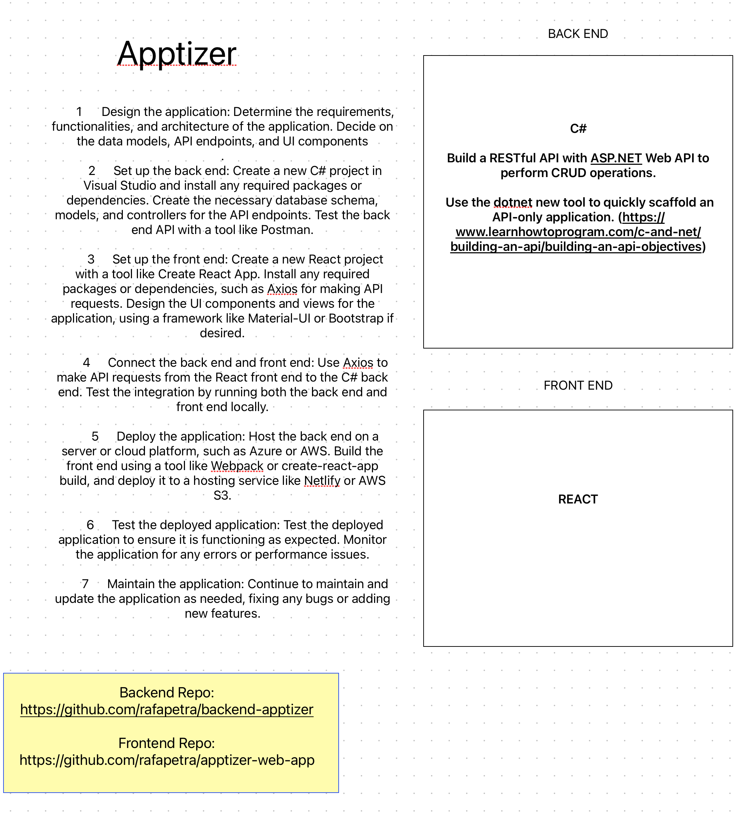

# Apptizer
An app/wesbite designed to make tracking your nutrition and macros simple and easy. Input your daily meals and snacks and get detailed breakdowns of your calorie and macronutrient intake. You can save your usual meals as favorites to save time. 

## Tech Stack

- C# backend
- Identity
- Entity
- MySQL database
- React front-end

## MVP Features
- Landing page with prominent CTA button to encourage sign up/log in
- Brief description of platform's benefits and features
- Components include sticky header, CTA button and daily intake/macros summary
- A summary of the user's daily macro and calorie intake, displayed in a clear and easy-to-read format.
- A log of the user's recent food intake, including the name of the food, the serving size, and the corresponding macros and calories.
- The ability to save frequently eaten meals for easy logging in the future.
- A progress tracker to show the user's progress towards their macro and calorie goals.
- A settings page to customize the user's goals and preferences, such as their daily macro targets and dietary restrictions.

## Stretch Goals

- A search bar to easily find and log new foods.

### Research & Planning Log
#### Friday, 04/07
* 2:40: create repo with readme + proposal

### Saturday, 04/08
* 2:30: Researching on how to start and structure the app by re visiting older lessons in learnhottoprogram to refresh about APIs and C#.
* 3:20: Visually structured how the App will be built with a list of steps to take.
* 7:18: Created repo for backend
* 7:20: Finished structuring the initial guideline to start coding:

  

